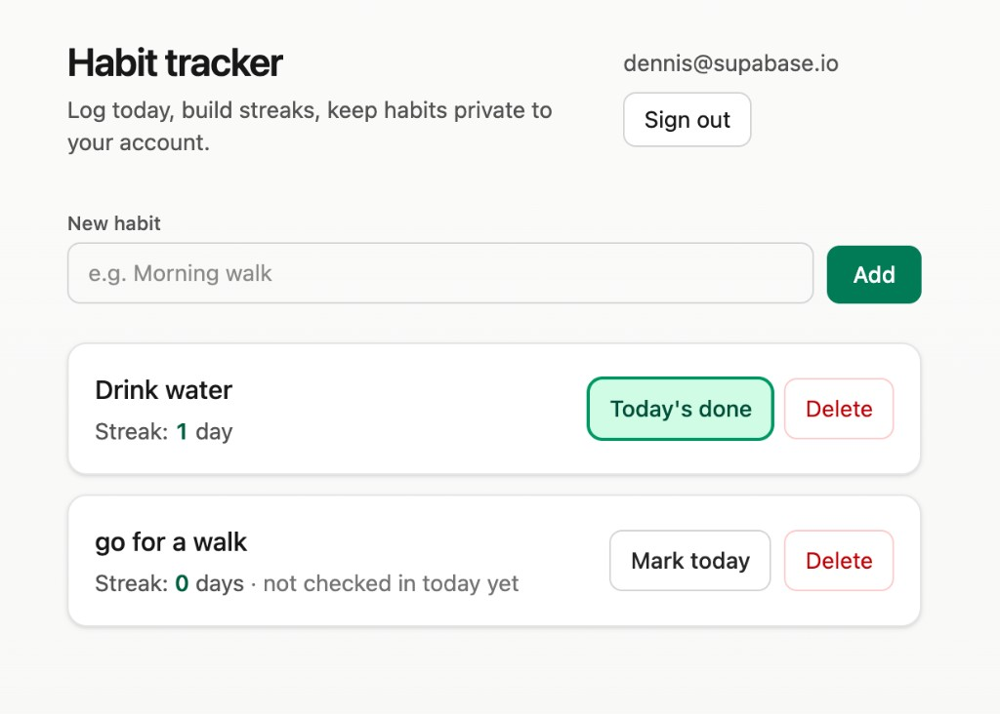

# Habit tracker

This app helps you build routines: you name a habit, tap when you have done it today, and it shows how many days in a row you have kept it up (your streak). You need a free local account so only you can see and change your list.

## What the screen looks like

When you are signed in, the main page is a simple, light layout with green action buttons. Your **email** appears in the top corner next to **Sign out**. Under the title and short subtitle you get:

- **New habit** — a single field (placeholder such as “Morning walk”) and an **Add** button.
- **Each habit as its own card** — the habit name, a **Streak** line (number of days in a row, or a note if today is not checked yet), **Today’s done** or **Mark today** depending on state, and **Delete**.

## How to open it

1. Install [Bun](https://bun.sh) on your computer if you do not already have it (the site has a one-line installer).
2. Open a terminal, go into this folder, then run:
   - `bun install`
   - `bun dev`
3. When the terminal says the dev server is ready, open **http://localhost:5173** in your browser.

Data is stored in a small database on your machine while you use this mode (through **Supabase Lite**, which runs together with the dev server). It is not sent to a hosted cloud service in this setup.

## How to use it

1. **Sign up** with any email and a password (at least six characters). Or **sign in** if you already created an account on this same computer and database.
2. Type a habit name (for example “Drink water”) and click **Add**.
3. Each day, click **Mark today** when you complete the habit. Click again to undo if you tapped by mistake.
4. **Streak** counts consecutive calendar days. If you have not marked today yet, yesterday still counts so your streak does not drop until a full day is missed.
5. **Delete** removes a habit and its history for your account.

## Troubleshooting

- **“Port 5173 is already in use”** — another app is using that port. Close the other app, or run Vite on another port (see the Vite docs for `--port`).
- **Blank page or auth errors after moving folders** — run `bun dev` again from this project folder so the local database and API start cleanly.
- **“Could not find the `user_id` column … in the schema cache”** after updating this project — your local SQLite file was created from an older schema. Stop the dev server, run **`bun run db:reset`**, then **`bun dev`** again. That deletes `supabase/.temp/` (your local habits data) and reapplies the current schema from `supabase/schemas/schema.sql`.

## Optional

- `bun run build` creates a static production bundle in `dist/`. For a full local stack with API and auth like in dev, you would run the Supabase Lite server separately and point the built app at it; the comfortable path for daily use is `bun dev`.

Built with React, TypeScript, Vite, Tailwind CSS, and **Supabase Lite** (`lite-supa`).
