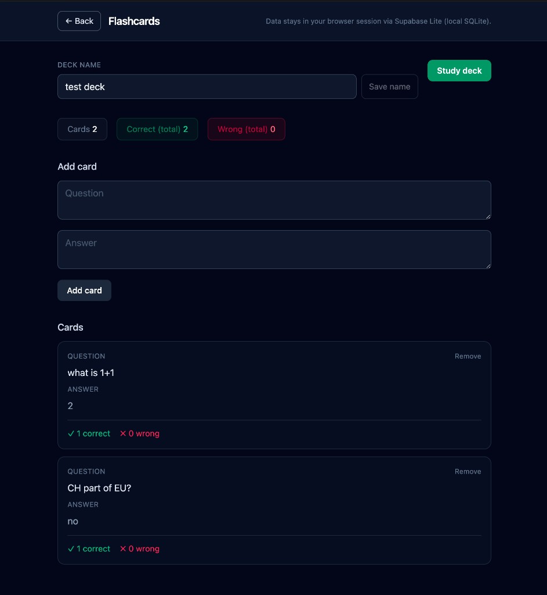

# Flashcards

**Flashcards** is a simple study app: you make decks, add question-and-answer cards, run study sessions, and the app remembers how many times you marked each card right or wrong.

Your cards are stored in a small database on your computer while the app is running (through Supabase Lite, which keeps everything local).



## How to open it

You need **Bun** to run the project. If you do not have it yet, install it from [https://bun.sh](https://bun.sh).

In a terminal, go to this folder, then run:

```bash
bun install
bun dev
```

When the terminal says the server is ready, open **http://localhost:5173** in your browser.

## How to use it

1. **Home** — Type a name for a deck and click **Create**. Click a deck name to open it.
2. **Inside a deck** — You can change the deck name with **Save name**. Add a **Question** and **Answer**, then **Add card**. Each card shows lifetime counts: how often you chose **Right** vs **Wrong** while studying.
3. **Study** — Click **Study deck**. You see one question at a time; tap **Show answer**, then **Wrong** or **Right**. The order is shuffled each session. When you finish the deck, you see a short summary for that round.

Data lives in a SQLite file under `supabase/.temp/` while Supabase Lite is running with the dev server. It is not sent to the cloud.

## Troubleshooting

- **Port 5173 already in use** — Another app is using that port. Close it or ask someone technical to change the port in `vite.config.ts` under `server.port`.
- **`bun run preview` or the built files show an empty list or errors** — The database only runs together with `bun dev` (the Vite + Supabase Lite setup). Use **`bun dev`** for normal use.
- **Install problems** — Run `bun install` again from this folder. Make sure your Bun version is current.

## Optional

To create a production build of the **frontend only**:

```bash
bun run build
```

The flashcard API is meant for local development with `bun dev`; do not expect the database to work from a static host without extra backend setup.
