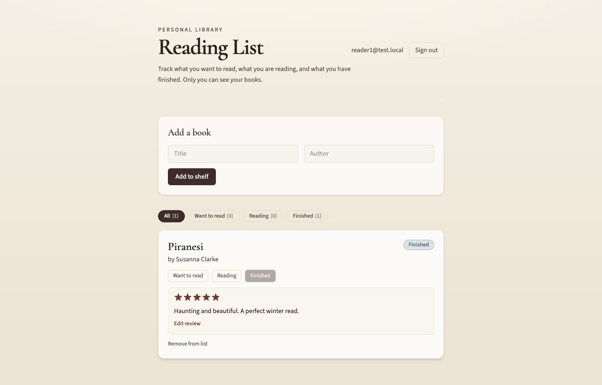

# Reading List

A simple app to keep track of books you want to read, are reading, or have finished. When you mark a book as finished, you can give it a star rating and a short review. Your list is private: only you can see your books after you sign in.



## How to open it

You need [Bun](https://bun.sh) installed on your computer (a small tool that runs the app). If you do not have it yet, install Bun from https://bun.sh, then follow these steps in a terminal:

1. Go into this project folder (the one that contains this README).
2. Run:

```bash
bun install
```

3. Start the app:

```bash
bun dev
```

4. Open the link shown in the terminal (usually **http://localhost:5173**). If that address is already in use, the terminal may show a different port such as **http://localhost:5174** — use whichever URL it prints.

The first time you run `bun dev`, the app sets up a small local database on your machine automatically. You do not need a separate database install.

## How to use it

1. **Create an account** — On the home screen, choose **Sign up**, enter your email and a password (at least 6 characters), then click **Create account**. You can also use **Sign in** if you already have an account.

2. **Add a book** — Type the **Title** and **Author**, then click **Add to shelf**. New books start as **Want to read**.

3. **Change status** — On each book card, click **Want to read**, **Reading**, or **Finished** to match where you are with that book.

4. **Rate and review (finished books only)** — After you mark a book **Finished**, click **Add rating & review**. Pick 1–5 stars and write a few words, then **Save**. You can **Edit review** later.

5. **Filter your shelf** — Use the pills at the top (**All**, **Want to read**, **Reading**, **Finished**) to show only certain books.

6. **Remove a book** — Hover a card and click **Remove from list** (you will be asked to confirm).

7. **Sign out** — Use **Sign out** in the header when you are done.

Your books and reviews are stored in a local database that runs on your computer while the app is running. They are tied to your account, not shared with other users.

## Troubleshooting

- **“Port already in use”** — Another app is using the same port. Use the alternate URL Vite prints (for example `http://localhost:5174`), or stop the other app and run `bun dev` again.

- **Cannot sign in** — Make sure you used the same email and password as when you signed up. Passwords must be at least 6 characters.

- **Page will not load** — Run `bun install` again, then `bun dev`. Keep the terminal window open while you use the app.

## Optional: production build

To build a static version of the front end:

```bash
bun run build
bun run preview
```

The local database and sign-in still expect `bun dev` for full functionality during development.

## Technical note

Built with React, Vite, Tailwind, and [Supabase Lite](https://github.com/supabase/lite) (`@supabase/lite` via pkg.pr.new build 203) for auth and data on your machine.
